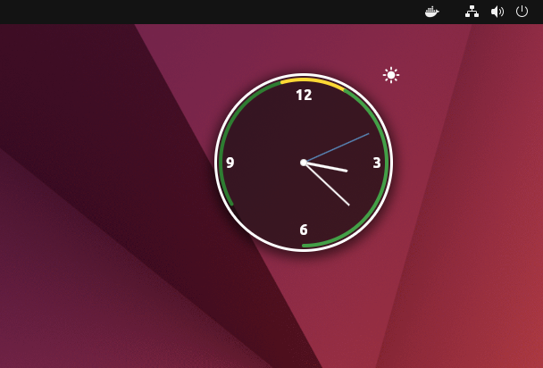

# Analog Clock

<p align="center">
  
</p>

A beautiful analog clock application built with Flutter.

## Build Instructions

### Prerequisites
- [Flutter](https://flutter.dev/docs/get-started/install) (ensure it's added to your PATH)
- Linux development environment

### Building the Application

1. **Get dependencies:**
   ```bash
   flutter pub get
   ```
2. **Build for Linux:**
   ```bash
   flutter build linux
   ```
   The built binary will be located at:
   ```
   build/linux/x64/release/bundle/analog_clock
   ```

## Linking to `/usr/local/bin`

To make your application easily executable from anywhere, you can link the built binary to `/usr/local/bin`:

1. **Link the binary:**
   ```bash
   sudo ln -sf $(pwd)/build/linux/x64/release/bundle/analog_clock /usr/local/bin/analog_clock
   ```
   This creates a symbolic link so you can run `analog_clock` from any terminal.

2. **(Optional) Make sure the binary is executable:**
   ```bash
   chmod +x build/linux/x64/release/bundle/analog_clock
   ```

Now you can launch the app by simply typing `analog_clock` in your terminal.
